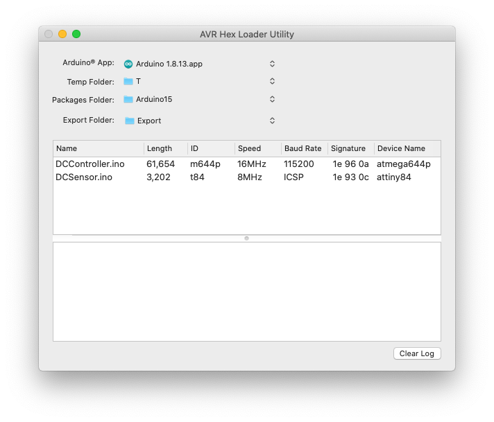
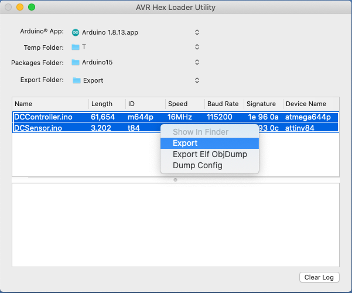

# HexLoaderUtility

HexLoaderUtility is an Objective-C Mac OS X app that exports Intel HEX and configuration files related to a sketch recently Verified or Uploaded using the Arduino IDE.

These files are for use with the SD Hex Loader ISP board.  See the [SD Hex Loader ISP instructable](https://github.com) << Will update once the instructable is published << for a detailed description of this board.

# Usage
Launch both the Arduino IDE and the HexLoaderUtility applications.  Note that when the Arduino IDE quits it removes all of the temporary files created since the IDE launched.  For this reason you need to keep the Arduino IDE running while using the HexLoaderUtility.  The first time you run the HexLoaderUtility you need to select the Arduino IDE and the folder where you would like to export the hex and configuration files.

In the Arduino IDE, select Verify for each of the sketches you would like to get the hex files for.  When you switch to the HexLoaderUtility, the list of sketches successfully verified will appear in the HexLoaderUtility table.

  

In this table, select the sketches to be exported, then right-click to display the contextual menu.  Select Export from this menu.  The hex and generated configuration files will appear in the designated Export folder.

  

Other HexLoaderUtility features avalable in the contextual menu:
- Show in Finder - opens the Arduino IDE's temporary folder for the selected sketch.  Disabled for multiple selections.
- Export Elf ObjDump - runs ObjDump on the selected sketch and places the output in the export folder.
- Dump Config - dumps the selected sketch's configuration.  Same content as the exported configuration file.

# Building
The app can currently only be built as a non-sandboxed app.  Preliminary work has been started to make it a sandboxed app but it hasn't been tested. A built non-sandboxed regular app is included in the repository. 